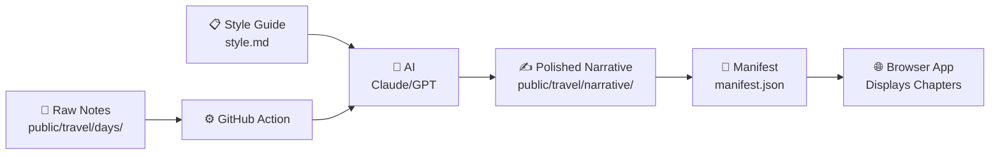

# Travel Journal Web App

A web application that displays travel journal chapters from markdown files. The app is content-driven, meaning everything is controlled by the files you write, not hardcoded into the code.

## Table of Contents

- [How It Works](#how-it-works)
- [Where Content Lives](#where-content-lives)
- [How the App Gets Built](#how-the-app-gets-built)
- [Project Structure](#project-structure)
- [Data Flow](#data-flow)
- [Key Rule: Content First](#key-rule-content-first)
- [Testing](#testing)

## How It Works

### Behind the Scenes: Converting Notes to Narrative



The workflow starts before the app even loads:

1. You write raw notes in `public/travel/days/*.md` (quick thoughts, observations, bullet points)
2. A GitHub Action detects these files and sends them to an AI (like Claude or GPT)
3. The AI reads `public/travel/style.md`, which contains a detailed style guide describing:
   - The voice and tone you want (observational? humorous? reflective?)
   - Formatting rules (how to structure chapters, add poems, format headings)
   - Writing preferences (sensory details, pacing, what to avoid)
4. The AI rewrites your raw notes into polished narrative chapters, following the style guide
5. These rewritten chapters are saved to `public/travel/narrative/*.md`
6. A manifest file is generated listing all the chapters in order

The style.md file is crucial—it's like giving the AI a detailed editor's instructions so the output matches your vision.

### In the Browser: How the App Displays Your Stories

When you open the app:

1. Load `public/travel/narrative/manifest.json` (a file listing all chapters)
2. Read the list of chapter markdown files from that manifest
3. Fetch those markdown files from disk
4. Convert the markdown into HTML that the browser can display
5. Show the current chapter on the screen
6. Load photos for that chapter from the photo index

So the app is controlled by content files in `public/travel/`, not by hardcoded lists in the application code.

## Where Content Lives

The markdown files live in `public/travel/` organized by their purpose:

```text
travel/
	days/
		2026-04-10.md
		2026-04-11.md
	narrative/
		2026-04-10.md
		2026-04-11.md
		manifest.json
	photos/
		2026-04-10/
			index.json
		2026-04-11/
			index.json
	style.md
```

**What each part does:**

- `public/travel/days/*.md` - Your raw notes for each day (optional reference material)
- `public/travel/narrative/*.md` - The polished, final chapters that display in the app
- `public/travel/narrative/manifest.json` - A master list that tells the app which chapters exist and in what order
- `public/travel/photos/<date>/index.json` - A list of photos for each chapter date
- `public/travel/style.md` - CSS styles for the app

The manifest file is special—it's the only file the app reads first. Everything else is discovered through it.

## How the App Gets Built

The application code is organized into logical sections, each with a specific job:

- **src/main.jsx** - Starts the app and prepares it to run
- **src/App.jsx** - Assembles the main page layout from smaller pieces
- **src/components/** - Individual UI pieces like the header, chapter view, photo gallery, and lightbox
- **src/hooks/** - App logic that controls state (which chapter to show, which photo is selected, etc.)
- **src/lib/** - Helper functions for common tasks like loading files, converting markdown, managing bookmarks, and formatting text
- **src/styles.css** - Visual styling for the app
- **scripts/** - Automated scripts that generate the manifest and photo indexes

## Architecture

### Entry Point

`src/main.jsx` is the starting point.

Its job is simple:

1. Import the CSS
## Project Structure

### How Files Are Organized

**`src/lib/` - Helper Functions**

These are utility functions that do basic jobs:

- `data.js` - Loads the manifest file, chapter markdown files, and photo lists
- `markdown.js` - Converts markdown text into HTML the browser can display
- `bookmark.js` - Manages bookmarks (remembering where you left off)
- `format.js` - Small utilities like creating URL slugs and escaping text

**`src/components/` - Page Sections**

Each component is one visual section of the page:

- `HeroPanel.jsx` - The header area with the title and chapter selector
- `ChapterView.jsx` - The main chapter text, plus previous/next navigation
- `PhotoGallery.jsx` - Thumbnail photos for the current chapter
- `Lightbox.jsx` - Full-screen photo viewer when you click a thumbnail
- `BookmarkBanner.jsx` - "Continue where you left off" prompt

**`src/hooks/` - App Control Logic**

- `useJournalController.js` - The "control room" that orchestrates everything:
  - Loads chapter data when the app starts
  - Figures out which chapter to show based on the URL
  - Updates the bookmark cookie
  - Manages what happens when you click photos or navigation buttons
  - Updates the page title

Think of this file as the brain that decides what the page should display based on user actions and saved state.

## Data Flow

Here's the path data takes through the app:

1. App starts and loads `useJournalController.js`
2. The controller asks `data.js` to load the manifest and chapters
3. The controller figures out which chapter should be shown
4. This information is passed to `App.jsx`, which arranges the page layout
5. Each component (header, chapter view, photo gallery) displays its part of the data
6. When you click a photo, the lightbox opens and shows that photo
7. When you navigate to a new chapter, the controller updates what's shown

The separation is clean: content loading, state management, and the visual display are kept separate.

## Key Rule: Content First

That file defines:

- What chapters exist
- What order they appear in
- Which markdown file belongs to each chapter

If chapter discovery or ordering changes, it should be controlled by the manifest generator script, not hardcoded into the app.

## Testing

The project includes a test suite using Vitest and Testing Library that covers:

- Chapter rendering
- Navigation between chapters
- Error states
- Photo gallery and lightbox interactions

Run tests with:

```bash
npm test
```

Run tests in watch mode (reruns automatically as you edit):

```bash
npm run test:watch
```

## Getting Started Locally

1. Install dependencies:

	```bash
	npm install
	```

2. Start the development server:

	```bash
	npm run dev
	```

3. Open the app in your browser (usually `http://localhost:5173`)

To build for production:

```bash
npm run build
```

To preview the production build:

```bash
npm run preview
```
